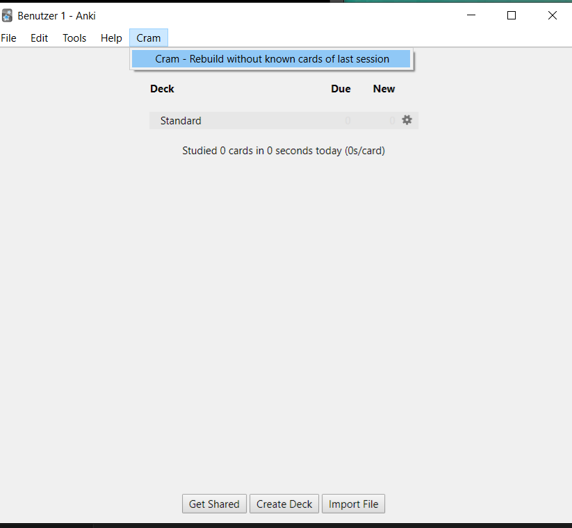
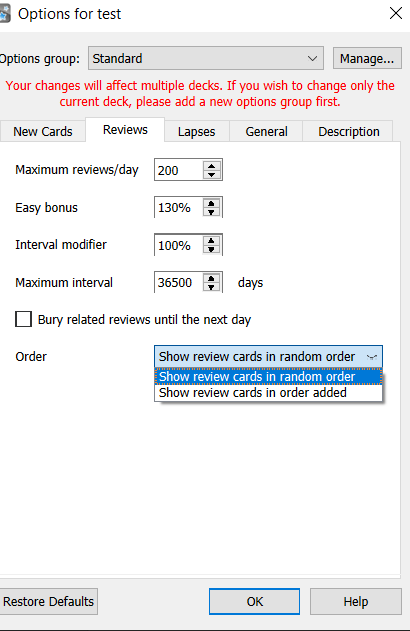

# Plugins-Anki

1. Counter: Test Plugin: fügt einen Kartenzähler im Unterordner "Tools" hinzu.
2. Cram Plugin
3. FlipCard
4. reviewOrder

### Cram Plugin:

### ReviewOrder Plugin

## Installation
1. Ordner mit Inhalt nach addon21 kopieren!
2. Anki neu starten.
